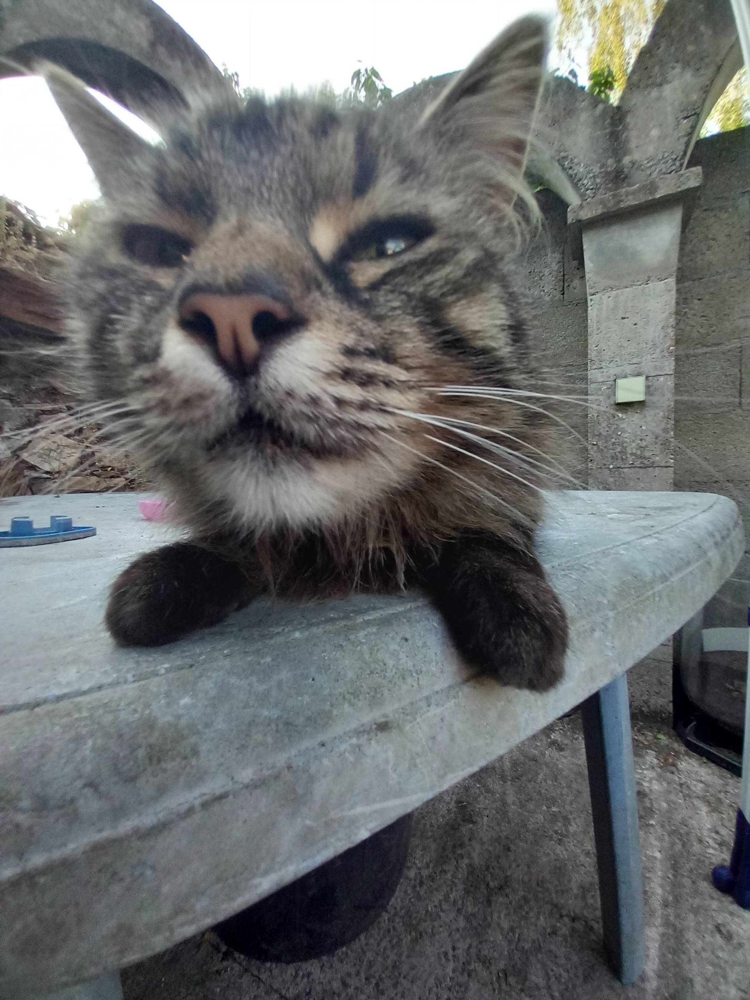

<html lang="pl">
<head>
<meta charset="UTF-8">
<title>Walentynki 💖</title>

</head>

<body>

    
    <h1>Czy zostaniesz moją walentynką? 🤔</h1>
    <button id="yes" onclick="yes()">TAK</button>
    <button id="no" onclick="no()">NIE</button>

<audio id="popSound" preload="auto">
    <source src="https://cdn.pixabay.com/audio/2022/03/15/audio_4c8a2b8c6b.mp3" type="audio/mpeg">
</audio>

</body>
</html>
